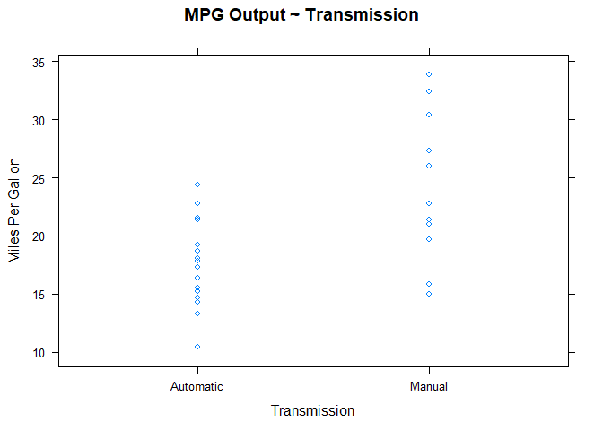

# MPG Comparison: Automatic vs Manual Transmission
Jack Welch  
June 16, 2017  

## Executive Summary

A popular technique in statistical analysis is linear regression which allows us to investigate the relationship between a response variable (y) and one or more input or predictor variables (x, x~1~ ... x~n~). We reviewed a rather complex mathematical model which allows us to calculate a linear regression model; however R makes this easy for us with a built in function: lm(y ~ x, data)

This exercise will allow me to demonstrate the use of this linear regression tool (as well as other statistical methods in R) so that we can use a rather small sample dataset to draw inferences about a rather large population for which this sample set represents.

From our analysis of the mtcars dataset, we have determined that there is in fact a significant difference in the MPG output of a vehicle based on the type of transmission used.  We will further conclude that this is not the only variable which impacts the MPG output of a vehicle.  In fact, we will demonstrate that the vehicle weight and the number of cylinders are the more significant contributors to the MPG output of a vehicle.

## Data Summary

From the documentation found online at the following link: [https://stat.ethz.ch/R-manual/R-devel/library/datasets/html/mtcars.html], we outline the following information that describes the data that is available to support this analysis.

1. cyl: number of cylinders (factor, 4,6,8)
2. disp: displacement (cu.in.) (numerical)
3. hp: gross horsepower (numerical)
4. drat: rear axle ratio (numerical)
5. wt: weight (1000 pounds) (numerical)
6. qsec: 1/4 mile time (numerical)
7. vs: V/S, V-engine or Straight engine (factor, V,S)
8. am: transmission type (factor, automatic, manual)
9. gear: number of gears (factor, 3,4,5)
10. carb: number of carburetors (factor, 1,2,3,4,5,6,7,8)

## Data Exploration

To get started, we know very little about the size and the structure of the mtcars dataset.  We need to conduct a few data mining techniques that will give us some visualization of the dataset so that we can begin to identify the column names, as this will be necessary in order to execute R programming commands correctly.  It is also helpful to understand the size of the data set before we get started in order to be sure that we have adequate compute power to run analytical exercises on the desired dataset.


```r
# Load the datasets library which is available in R
library("datasets")

# Change the output of the MD file to 90 columns instead of the default value of 80 columns.
# This is just for a matter of convenience in the visualization of the output of the report.
options("width"=90)

# Output the structure of the mtcars dataset
str(mtcars)
```

```
## 'data.frame':	32 obs. of  11 variables:
##  $ mpg : num  21 21 22.8 21.4 18.7 18.1 14.3 24.4 22.8 19.2 ...
##  $ cyl : num  6 6 4 6 8 6 8 4 4 6 ...
##  $ disp: num  160 160 108 258 360 ...
##  $ hp  : num  110 110 93 110 175 105 245 62 95 123 ...
##  $ drat: num  3.9 3.9 3.85 3.08 3.15 2.76 3.21 3.69 3.92 3.92 ...
##  $ wt  : num  2.62 2.88 2.32 3.21 3.44 ...
##  $ qsec: num  16.5 17 18.6 19.4 17 ...
##  $ vs  : num  0 0 1 1 0 1 0 1 1 1 ...
##  $ am  : num  1 1 1 0 0 0 0 0 0 0 ...
##  $ gear: num  4 4 4 3 3 3 3 4 4 4 ...
##  $ carb: num  4 4 1 1 2 1 4 2 2 4 ...
```
Here, we observe that the mtcars dataset contains 32 observations of 11 variables.  This is a small dataset.  Each of the variables contain numerical values which, in most cases, can easily be analyzed without additional transformation.  We also observe the existing data given for 'mpg' as an outcome or response to a targeted predictor variable.  Our desired predictor is denoted as 'am' and the value of this field appears to represent the following:

    0 = automatic transmisssion
    1 = manual transmission

Let's now use the head function in order to visualize the first few rows of the dataset.


```r
# Use the head function to output first few rows of the mtcars dataset
head(mtcars)
```

```
##                    mpg cyl disp  hp drat    wt  qsec vs am gear carb
## Mazda RX4         21.0   6  160 110 3.90 2.620 16.46  0  1    4    4
## Mazda RX4 Wag     21.0   6  160 110 3.90 2.875 17.02  0  1    4    4
## Datsun 710        22.8   4  108  93 3.85 2.320 18.61  1  1    4    1
## Hornet 4 Drive    21.4   6  258 110 3.08 3.215 19.44  1  0    3    1
## Hornet Sportabout 18.7   8  360 175 3.15 3.440 17.02  0  0    3    2
## Valiant           18.1   6  225 105 2.76 3.460 20.22  1  0    3    1
```

```r
# I want to now make an adjustment to the table by changing the values of 0 and 1
# within the 'am' field to 'automatic' and 'manual' respectively.
mtcars$am <- factor(mtcars$am,levels=c(0,1), labels=c("Automatic","Manual"))

# Let's change the column names from 'am' to 'Transmission' and 'mpg' to 'MPG'
colnames(mtcars)[colnames(mtcars)=="am"] <- "Transmission"
colnames(mtcars)[colnames(mtcars)=="mpg"] <- "MPG"

# Let's now convert some of the important predictor variables to factor variables
mtcars$cyl <- factor(mtcars$cyl)
mtcars$vs <- factor(mtcars$vs)
mtcars$gear <- factor(mtcars$gear)
mtcars$carb <- factor(mtcars$carb)
mtcars$cyl <- factor(mtcars$cyl)

# Let's drop the variables which are likely output variables
mtcars[,c("hp")] <- list(NULL)
mtcars[,c("qsec")] <- list(NULL)

# Let's visualize the changes to the dataset
head(mtcars)
```

```
##                    MPG cyl disp drat    wt vs Transmission gear carb
## Mazda RX4         21.0   6  160 3.90 2.620  0       Manual    4    4
## Mazda RX4 Wag     21.0   6  160 3.90 2.875  0       Manual    4    4
## Datsun 710        22.8   4  108 3.85 2.320  1       Manual    4    1
## Hornet 4 Drive    21.4   6  258 3.08 3.215  1    Automatic    3    1
## Hornet Sportabout 18.7   8  360 3.15 3.440  0    Automatic    3    2
## Valiant           18.1   6  225 2.76 3.460  1    Automatic    3    1
```

```r
# Output the revised structure of the mtcars dataset
str(mtcars)
```

```
## 'data.frame':	32 obs. of  9 variables:
##  $ MPG         : num  21 21 22.8 21.4 18.7 18.1 14.3 24.4 22.8 19.2 ...
##  $ cyl         : Factor w/ 3 levels "4","6","8": 2 2 1 2 3 2 3 1 1 2 ...
##  $ disp        : num  160 160 108 258 360 ...
##  $ drat        : num  3.9 3.9 3.85 3.08 3.15 2.76 3.21 3.69 3.92 3.92 ...
##  $ wt          : num  2.62 2.88 2.32 3.21 3.44 ...
##  $ vs          : Factor w/ 2 levels "0","1": 1 1 2 2 1 2 1 2 2 2 ...
##  $ Transmission: Factor w/ 2 levels "Automatic","Manual": 2 2 2 1 1 1 1 1 1 1 ...
##  $ gear        : Factor w/ 3 levels "3","4","5": 2 2 2 1 1 1 1 2 2 2 ...
##  $ carb        : Factor w/ 6 levels "1","2","3","4",..: 4 4 1 1 2 1 4 2 2 4 ...
```
## MPG from Transmission Selection

The following boxplot will demonstrate that there is an expected increase of 7.25 MPG output of a vehicle with a manual transmission vs one with an automatic transmission.


```r
# Boxplot allowing us to visualize our data distribution
library("ggplot2")
plot1 <- ggplot(mtcars, aes(x=factor(Transmission), y=MPG, fill=Transmission))
plot1 + geom_boxplot(notch=F) + 
       scale_x_discrete("Transmission") +   
       scale_y_continuous("Miles/Gallon") +  
       ggtitle("MPG Comparison") +
       theme(plot.title = element_text(hjust = 0.5))
```

<!-- -->

Let's now quantify the actual means of the MPG output for each transmission type.


```r
# Automatic Transmission
auto_mean = mean(subset(mtcars, mtcars$Transmission=="Automatic")$MPG)
auto_mean
```

```
## [1] 17.14737
```

```r
# Manual Transmission
manual_mean = mean(subset(mtcars, mtcars$Transmission=="Manual")$MPG)
manual_mean
```

```
## [1] 24.39231
```
This "mean" calculation quickly and easily implies that there is an expected higher MPG output with cars with manual transmissions vs those with automatic transmission.  But to draw this conclusion, we would have to assume that the MPG output is entirely dependent on the choice in transmission and that the MPG output has nothing to do with the other variables.  With just a simple inspection of the other variables, it is rather intuitive to think that the MPG output would be highly dependent on the number of cylinders, the engine displacement, the weight of the vehicle, and possibly some of the other variables as well.  To completely answer the question about whether or not MPG output improves with a manual or automatic transmission, some analysis needs to be done to see if there is a co-dependency on the other "confounding" variables.

## Multi-Variable Regression

R offers a method for preparing a linear model for completing a regression analysis that will include all of the variables within the dataset.


```r
mv_model <- lm(MPG ~ ., data = mtcars)
summary(mv_model)
```

```
## 
## Call:
## lm(formula = MPG ~ ., data = mtcars)
## 
## Residuals:
##     Min      1Q  Median      3Q     Max 
## -5.0065 -1.0439 -0.0972  0.8273  4.8470 
## 
## Coefficients:
##                    Estimate Std. Error t value Pr(>|t|)  
## (Intercept)        25.50598   12.24527   2.083   0.0527 .
## cyl6               -2.66753    2.94412  -0.906   0.3776  
## cyl8               -6.37681    6.27270  -1.017   0.3236  
## disp                0.02453    0.03220   0.762   0.4565  
## drat                1.11230    2.58756   0.430   0.6727  
## wt                 -3.58800    2.53235  -1.417   0.1746  
## vs1                 0.07974    2.76170   0.029   0.9773  
## TransmissionManual  0.47498    2.92624   0.162   0.8730  
## gear4               3.13812    3.62975   0.865   0.3993  
## gear5               1.25324    3.81327   0.329   0.7464  
## carb2              -1.24022    2.26503  -0.548   0.5911  
## carb3               0.83990    4.31610   0.195   0.8480  
## carb4              -3.95375    3.45261  -1.145   0.2680  
## carb6              -2.51155    5.37627  -0.467   0.6463  
## carb8              -4.36983    5.85789  -0.746   0.4659  
## ---
## Signif. codes:  0 '***' 0.001 '**' 0.01 '*' 0.05 '.' 0.1 ' ' 1
## 
## Residual standard error: 2.957 on 17 degrees of freedom
## Multiple R-squared:  0.868,	Adjusted R-squared:  0.7592 
## F-statistic: 7.983 on 14 and 17 DF,  p-value: 6.17e-05
```
From the cooefficients above, we note that weight is in fact a more significant factor in the measured MPG output, even more so than the choice of transmission.  R offers another function, the step() function, which will allow us to select the variables which yield the most significant impact on the output variable, MPG.


```r
step_model <- step(lm(MPG ~ ., data = mtcars), trace = 0)
summary(step_model)
```

```
## 
## Call:
## lm(formula = MPG ~ cyl + wt, data = mtcars)
## 
## Residuals:
##     Min      1Q  Median      3Q     Max 
## -4.5890 -1.2357 -0.5159  1.3845  5.7915 
## 
## Coefficients:
##             Estimate Std. Error t value Pr(>|t|)    
## (Intercept)  33.9908     1.8878  18.006  < 2e-16 ***
## cyl6         -4.2556     1.3861  -3.070 0.004718 ** 
## cyl8         -6.0709     1.6523  -3.674 0.000999 ***
## wt           -3.2056     0.7539  -4.252 0.000213 ***
## ---
## Signif. codes:  0 '***' 0.001 '**' 0.01 '*' 0.05 '.' 0.1 ' ' 1
## 
## Residual standard error: 2.557 on 28 degrees of freedom
## Multiple R-squared:  0.8374,	Adjusted R-squared:   0.82 
## F-statistic: 48.08 on 3 and 28 DF,  p-value: 3.594e-11
```

We see from the step model that the number of cylinders and the vehicle weight contribute most significantly to the measurement of the MPG output of a vehicle.  Let's visualize these relationships on a couple of scatter plots.


```r
library("lattice")
xyplot(MPG ~ cyl, data = mtcars,
  xlab = "Cylinders",
  ylab = "Miles Per Gallon",
  main = "MPG Output ~ Cylinder Selection"
)
```

<!-- -->


```r
xyplot(MPG ~ wt, data = mtcars,
  xlab = "Weight",
  ylab = "Miles Per Gallon",
  main = "MPG output ~ Vehicle Weight"
)
```

<!-- -->


```r
xyplot(MPG ~ Transmission, data = mtcars,
  xlab = "Transmission",
  ylab = "Miles Per Gallon",
  main = "MPG Output ~ Transmission"
)
```

<!-- -->

## Conclusion

The analysis shown here clearly indicates that there is a strong relationship of MPG output based on the selection of the vehicle transmission type.  With regression analysis, we further demonstrate that MPG output is also related to other important factors and these include the number of cylinders in the engine and the vehicle weight.


## References

1. "Motor Trend Car Road Tests" - [https://stat.ethz.ch/R-manual/R-devel/library/datasets/html/mtcars.html]

